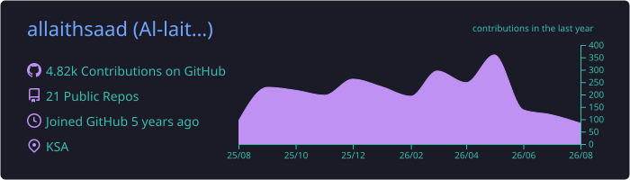
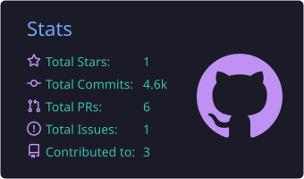
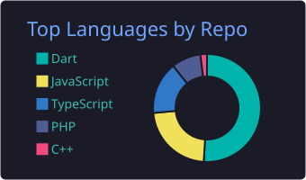
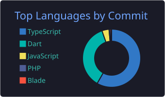
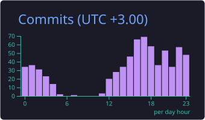

 

  

I build production mobile and web applications end to end — from Flutter clients and TypeScript dashboards
to the databases, pipelines, and cloud infrastructure running behind them.

---

## 🧭 What I Work On

<table>
<tr>
<td width="50%" valign="top">

### 📱 Mobile Engineering

Multi-role Flutter applications shipped to iOS and Android — offline-tolerant flows, hardware integrations (NFC, QR, camera), push notifications, and over-the-air patching.

  

</td>
<td width="50%" valign="top">

### 🖥️ Web Dashboards

Data-dense admin panels in Next.js — server components, complex tables, role-based access, and fully bilingual Arabic/English interfaces with real RTL support.

  

</td>
</tr>
<tr>
<td width="50%" valign="top">

### ☁️ Cloud &amp; DevOps

Self-managed cloud deployments — containerized services behind Nginx, process management with PM2, and multi-environment CI/CD pipelines.

  

</td>
<td width="50%" valign="top">

### 🔐 Data &amp; Security

Relational and geospatial data modelling, plus hands-on API security review — authentication, authorization, and access-control hardening.

  

</td>
</tr>
</table>

---

## 🧰 Tech Stack

**Mobile**

**Web**

**Backend &amp; Data**

**Infrastructure &amp; DevOps**

---

## 📊 GitHub Activity

  

---

## 🐍 Contribution Snake

<picture>
  <source media="(prefers-color-scheme: dark)" srcset="https://raw.githubusercontent.com/allaithsaad/allaithsaad/output/snake-dark.svg" />
  <source media="(prefers-color-scheme: light)" srcset="https://raw.githubusercontent.com/allaithsaad/allaithsaad/output/snake.svg" />
  
</picture>

---

**Let's build something together.**

Reach me on [LinkedIn](https://www.linkedin.com/in/allaithalaqraa) or by [email](mailto:work.laith@gmail.com).

